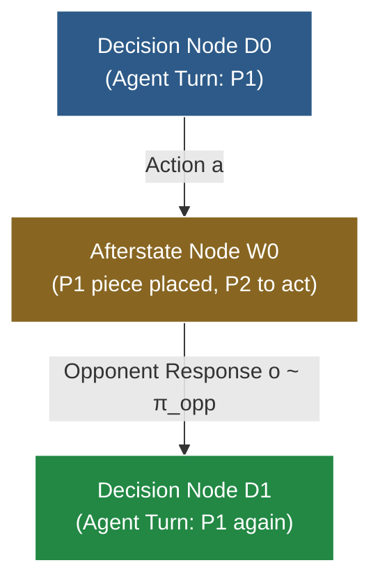

# RFC: Round-Based Macro-Dynamics, Afterstate Nodes & Pluggable Opponent Policies

This document explores the architectural design, formal invariants, and trade-off evaluation for **Round-Based Macro-Dynamics**, **Afterstate Nodes** (Stochastic MuZero / Sutton & Barto style), and **Pluggable Opponent Policies** in the Monte Carlo Tree Search (MCTS) engine.

---

## 1. Motivation & Context

In 2-player turn-based games such as Connect 4 and Hex, the standard convention is **Alternating Multi-Agent Dynamics**:
- State explicitly tracks `current_player`.
- Each transition steps 1 half-move (ply), toggling `current_player = current_player.other()`.
- The search tree alternates between nodes where Player 1 acts and nodes where Player 2 acts.
- Returns are tracked as vectors $\mathbf{Q} \in \mathbb{R}^2$ via [`VectorBackup<2>`](../mcts-engine/src/backup/vector.rs), with selection maximizing the active player's component.

While this approach unifies cleanly with $N$-player games (like 4-player Blokus) and guarantees worst-case adversarial robustness (Minimax equilibrium), it introduces specific friction points:
1. **Evaluator Dilution**: Neural networks or heuristic evaluation models must learn to evaluate positions from *both* players' perspectives (or invert inputs/outputs).
2. **Shallow Effective Depth**: An MCTS search to tree depth $d$ only plans $d / 2$ full game rounds.
3. **Rigid Adversary Assumption**: Standard minimax MCTS assumes the opponent is a game-theoretically optimal adversary. It cannot naturally exploit predictable weaknesses, heuristic patterns, or stochastic tendencies of specific opponents.

---

## 2. Core Concepts & Formal Invariants

### 2.1 Why "Afterstate Node" (vs. "Chance Node")

In reinforcement learning literature (Sutton & Barto, §6.8 *Games, Afterstates, and Other Special Cases*), an **afterstate** is defined as:
> The state immediately *after* the agent commits an action, but *before* the environment's dynamics, chance events, or opponent responses resolve.

```
[Decision Node s_t] ──(Agent Action a)──> [Afterstate Node w_t] ──(Opponent Response o)──> [Decision Node s_{t+1}]
     (My Turn)                               (Waiting for Opponent)                             (My Turn Again)
```

In Connect 4:
- $s_t$: Board state where it is Red's turn to move.
- $w_t$: Board state with Red's piece placed in column $a$, but Yellow has not moved yet.
- $s_{t+1}$: Board state where Yellow has placed piece in column $o$. Red sees the full board and moves again.

Calling $w_t$ an **Afterstate Node** (rather than a "Chance Node") is mathematically precise because the transition out of $w_t$ is not necessarily pure random noise—it can be governed by a deterministic heuristic, a bounded-rational model, an opponent policy network, or an adversarial minimax selection.

### 2.2 The Fundamental Invariant: Trajectories Always End at Decision Nodes

The core architectural invariant proposed is:

$$\text{All MCTS simulation trajectories must terminate and evaluate ONLY at Decision Nodes (or terminal states).}$$



#### Why This Invariant is Essential:
1. **Pure Agent-Centric Evaluation**: The evaluator (`Model::evaluate`) is **only ever invoked on Decision Nodes**. The value function $V(s)$ and policy prior $P(s, a)$ only need to understand positions where it is the primary agent's turn to move.
2. **Strict Round-Level Lookahead**: Every tree iteration advances the simulation by an integer number of full rounds. A tree depth of $d$ guarantees $d$ full rounds (or $2d$ plies) of strategic lookahead.
3. **Clean Terminal Short-Circuiting**: If the primary agent's action $a$ immediately wins the game or fills the board, the transition terminates immediately without an opponent response, naturally creating a terminal Decision Node.

---

## 3. Tree Representation & Zero-Change Compatibility

### 3.1 Node Labeling via `AgentId`

In `mcts-engine::tree_store::TreeStore`, every node already carries an `AgentId`:

```rust
struct NodeArrays {
    parent_edge: Vec<EdgeId>,
    first_child_edge: Vec<EdgeId>,
    num_children: Vec<u32>,
    agent: Vec<AgentId>,
    status: Vec<NodeStatus>,
}
```

Because `store.node_agent(node)` is stored directly in the flat contiguous array:
- **Decision Node**: `store.node_agent(node) == store.node_agent(root)` (matches root agent).
- **Afterstate Node**: `store.node_agent(node) != store.node_agent(root)` (opponent acts).

**No modifications to `TreeStore` data structures or memory layout are required.**

---

## 4. Architectural Implementation Routes

Standard MCTS schedulers (like `SequentialScheduler`) terminate traversal at the *first* unvisited edge (`if !child.is_valid() { break; }`). In a 1-ply step formulation, this would halt at Afterstate nodes on odd plies, violating the invariant.

Two distinct architectural routes resolve this:

### Route A: Two-Phase / Round Scheduler (`RoundScheduler`)

The scheduler explicitly distinguishes Decision Nodes from Afterstate Nodes:

```
Traversal Step:
  1. At Decision Node D_t:
     - Select child edge a via PUCT: argmax [ Q(D_t, a) + U(D_t, a) ].
     - Step dynamics: state -> afterstate w_t.
     - If w_t is terminal (immediate win/draw), mark terminal and break.
  2. At Afterstate Node w_t:
     - Expand opponent candidate moves using π_opp(o | w_t).
     - Select opponent edge o (via sampling ~ π_opp or adversarial selection).
     - Step dynamics: afterstate -> decision node D_{t+1}.
     - Break only when reaching Decision Node D_{t+1}.
```

#### Trait Abstraction for Pluggable Opponent Policy:

```rust
/// Pluggable policy governing opponent responses at afterstate nodes.
pub trait OpponentPolicy<State, Action> {
    /// Generates candidate opponent actions and their prior probabilities at afterstate `w`.
    fn candidates(&self, afterstate: &State, out: &mut Vec<(Action, f32)>);

    /// Samples or selects an opponent reply during simulation traversal.
    fn select_response(&self, afterstate: &State) -> Action;
}
```

* **Pros**: Explicit afterstates in the tree; shared afterstate transpositions; inspectable opponent branching.
* **Cons**: Requires a dedicated two-phase traversal loop in the search scheduler.

---

### Route B: Macro-Dynamics in `AgentDynamics` (Zero Engine Changes)

The opponent policy is absorbed directly inside `AgentDynamics::step`:

```rust
pub struct MacroConnect4Dynamics<P: OpponentPolicy<Connect4State, usize>> {
    pub opponent_policy: P,
}

impl<P> AgentDynamics for MacroConnect4Dynamics<P>
where
    P: OpponentPolicy<Connect4State, usize>,
{
    type State = Connect4State;
    type Action = usize; // Only primary agent's column
    type Reward = f32;   // Scalar return (+1 win, -1 loss, 0 draw)

    fn step(&self, s: &mut Self::State, action: &Self::Action) -> StepOutcome<Self::Reward> {
        // Step 1: Apply primary agent's action
        let row = s.drop_piece(*action).expect("legal move");
        if s.check_win_at(row, *action, Player::Red) {
            return StepOutcome::new(1.0, true);
        }
        if s.is_board_full() {
            return StepOutcome::new(0.0, true);
        }

        // Step 2: Opponent immediately replies via π_opp
        let opp_col = self.opponent_policy.select_response(s);
        let opp_row = s.drop_piece(opp_col).expect("legal opponent move");
        if s.check_win_at(opp_row, opp_col, Player::Yellow) {
            return StepOutcome::new(-1.0, true);
        }

        // Step 3: Returns state where it is primary agent's turn again!
        StepOutcome::new(0.0, s.is_board_full())
    }

    fn current_agent(&self, _s: &Self::State) -> AgentId {
        AgentId(0) // Always primary agent
    }
}
```

* **Pros**: Requires **zero changes** to `mcts-engine`, schedulers, or `TreeStore`. Runs immediately with existing `SequentialScheduler` and `SingleAgentBackup`.
* **Cons**: Afterstates are ephemeral inside `step()`; not stored or shared as nodes in `TreeStore`. If $\pi_{\text{opp}}$ is stochastic, standard single-pointer tree edges cannot represent multiple child outcomes without chance nodes.

---

## 5. Spectrum of Pluggable Opponent Policies

By parameterizing the opponent policy $\pi_{\text{opp}}$, the agent can adopt different planning strategies:

| Opponent Policy $\pi_{\text{opp}}$ | Mechanics | Best Used For |
| :--- | :--- | :--- |
| **`DeterministicHeuristic`** | Selects greedy 1-ply winning/blocking move or highest center-weight column. | Ultra-fast macro search (Route B); doubles effective depth with zero tree branching. |
| **`RandomOpponent`** | Uniform probability across all legal opponent columns. | Expectimax planning against beginners or chaotic environments (2048 tile spawn). |
| **`SoftmaxTactical`** | $\pi(o) \propto \exp(\text{score}(o) / \tau)$. Prioritizes threats while maintaining exploration. | Modeling human play or tournament pools with known tactical biases. |
| **`ForcedMoveAbsorption (Hybrid)`** | If opponent has an immediate win/block, absorb into `step()` (1 ply). Otherwise expand afterstate. | Preserving adversarial minimax safety while skipping obvious forced responses. |
| **`AdversarialMinimax`** | Selects $\arg\min Q$ (or runs PUCT for opponent). | Standard AlphaZero / game-theoretic optimal play. |

---

## 6. Comprehensive Trade-Off Evaluation

### 6.1 The Advantages

1. **Elimination of Evaluator Dilution**:
   Value and policy networks only need to predict values for the primary agent. Input tensors do not need "current player" indicators or channel inversions.
2. **Depth Compression for Forced Sequences**:
   In tactical endgames, many moves are forced replies. Absorbing forced moves doubles the lookahead depth per tree node.
3. **Exploitative Play Beyond Nash Equilibrium**:
   Minimax assumes a perfect opponent and plays conservatively. If the opponent has a known blind spot (e.g. failing to detect diagonal traps), a parameterized $\pi_{\text{opp}}$ allows MCTS to find winning traps that minimax would discard as "refutable by optimal play".

### 6.2 The Risks & Pitfalls

1. **Model Misspecification (The Delusion Hazard)**:
   If $\pi_{\text{opp}}$ assigns zero probability to an unorthodox move that the opponent *actually plays*, the MCTS agent will have zero tree branches prepared for that reply. Minimax remains the safest choice when the opponent's strategy is unknown.
2. **Branching Factor in Explicit Afterstates (Route A)**:
   If afterstates branch on all 7 opponent columns, the tree still contains $7 \times 7 = 49$ leaves per round. Explicit afterstates require candidate pruning (e.g. top-$K$ opponent moves) to achieve speedups.
3. **Self-Play Training Symmetry**:
   In AlphaZero self-play, both players share identical networks and update synchronously. Absorbing a static opponent policy is ideal for playing against humans or fixed agents, but complicates symmetric self-play training unless $\pi_{\text{opp}}$ is dynamically tied to the agent's current network checkpoint.

---

## 7. Recommendation & Future Roadmap

1. **Phase 1 (Immediate / Prototype)**:
   Implement `MacroConnect4Dynamics<P>` (Route B) with `HeuristicOpponent` and `ForcedMoveOpponent` to benchmark depth gains and tournament win-rates against standard `Connect4Dynamics`.
2. **Phase 2 (Engine Extension)**:
   Introduce `TwoPhaseScheduler` in `mcts-engine` with formal support for Afterstate nodes and Expectation backup at `node_agent != root_agent`.
3. **Phase 3 (Unified Stochastic Engine)**:
   Validate the `TwoPhaseScheduler` across both 2-player afterstates (Connect 4) and chance environments (2048/TZF8 tile spawns), proving full Stochastic MuZero equivalence.

