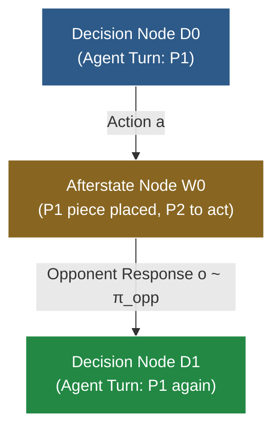

# RFC: Round-Based Macro-Dynamics, Afterstate Nodes & Pluggable Opponent Policies

This document explores the architectural design, formal invariants, and trade-off evaluation for **Round-Based Macro-Dynamics**, **Afterstate Nodes** (Stochastic MuZero / Sutton & Barto style), and **Pluggable Opponent Policies** in the Monte Carlo Tree Search (MCTS) engine.

---

## 1. Motivation & Context

In 2-player turn-based games such as Connect 4 and Hex, the standard convention is **Alternating Multi-Agent Dynamics**:
- State explicitly tracks `current_player`.
- Each transition steps 1 half-move (ply), toggling `current_player = current_player.other()`.
- The search tree alternates between nodes where Player 1 acts and nodes where Player 2 acts.
- Returns are tracked as vectors $\mathbf{Q} \in \mathbb{R}^2$ via [`VectorBackup<2>`](../mcts-engine/src/backup/vector.rs), with selection maximizing the active player's component.

While this approach unifies cleanly with $N$-player games (like 4-player Blokus) and guarantees worst-case adversarial robustness (Minimax equilibrium), it introduces specific friction points:
1. **Evaluator Dilution**: Neural networks or heuristic evaluation models must learn to evaluate positions from *both* players' perspectives (or invert inputs/outputs).
2. **Shallow Effective Depth**: An MCTS search to tree depth $d$ only plans $d / 2$ full game rounds.
3. **Rigid Adversary Assumption**: Standard minimax MCTS assumes the opponent is a game-theoretically optimal adversary. It cannot naturally exploit predictable weaknesses, heuristic patterns, or stochastic tendencies of specific opponents.

---

## 2. Core Concepts & Formal Invariants

### 2.1 Why "Afterstate Node" (vs. "Chance Node")

In reinforcement learning literature (Sutton & Barto, §6.8 *Games, Afterstates, and Other Special Cases*), an **afterstate** is defined as:
> The state immediately *after* the agent commits an action, but *before* the environment's dynamics, chance events, or opponent responses resolve.

```
[Decision Node s_t] ──(Agent Action a)──> [Afterstate Node w_t] ──(Opponent Response o)──> [Decision Node s_{t+1}]
     (My Turn)                               (Waiting for Opponent)                             (My Turn Again)
```

In Connect 4:
- $s_t$: Board state where it is Red's turn to move.
- $w_t$: Board state with Red's piece placed in column $a$, but Yellow has not moved yet.
- $s_{t+1}$: Board state where Yellow has placed piece in column $o$. Red sees the full board and moves again.

Calling $w_t$ an **Afterstate Node** (rather than a "Chance Node") is mathematically precise because the transition out of $w_t$ is not necessarily pure random noise—it can be governed by a deterministic heuristic, a bounded-rational model, an opponent policy network, or an adversarial minimax selection.

### 2.2 The Fundamental Invariant: Trajectories Always End at Decision Nodes

The core architectural invariant proposed is:

$$\text{All MCTS simulation trajectories must terminate and evaluate ONLY at Decision Nodes (or terminal states).}$$



#### Why This Invariant is Essential:
1. **Pure Agent-Centric Evaluation**: The evaluator (`Model::evaluate`) is **only ever invoked on Decision Nodes**. The value function $V(s)$ and policy prior $P(s, a)$ only need to understand positions where it is the primary agent's turn to move.
2. **Strict Round-Level Lookahead**: Every tree iteration advances the simulation by an integer number of full rounds. A tree depth of $d$ guarantees $d$ full rounds (or $2d$ plies) of strategic lookahead.
3. **Clean Terminal Short-Circuiting**: If the primary agent's action $a$ immediately wins the game or fills the board, the transition terminates immediately without an opponent response, naturally creating a terminal Decision Node.

---

## 3. Tree Representation & Zero-Change Compatibility

### 3.1 Node Labeling via `AgentId`

In `mcts-engine::tree_store::TreeStore`, every node already carries an `AgentId`:

```rust
struct NodeArrays {
    parent_edge: Vec<EdgeId>,
    first_child_edge: Vec<EdgeId>,
    num_children: Vec<u32>,
    agent: Vec<AgentId>,
    status: Vec<NodeStatus>,
}
```

Because `store.node_agent(node)` is stored directly in the flat contiguous array:
- **Decision Node**: `store.node_agent(node) == store.node_agent(root)` (matches root agent).
- **Afterstate Node**: `store.node_agent(node) != store.node_agent(root)` (opponent acts).

**No modifications to `TreeStore` data structures or memory layout are required.**

---

## 4. Architectural Implementation Routes

Standard MCTS schedulers (like `SequentialScheduler`) terminate traversal at the *first* unvisited edge (`if !child.is_valid() { break; }`). In a 1-ply step formulation, this would halt at Afterstate nodes on odd plies, violating the invariant.

Two distinct architectural routes resolve this:

### Route A: Coordinated Round Scheduler (`RoundScheduler`)

The scheduler explicitly coordinates descent between Decision Nodes ($D_t$) and Afterstate Nodes ($W_t$) in the tree, retaining explicit nodes for both players while maintaining the Single-Perspective Leaf Evaluation Invariant:

```
Traversal Step:
  1. At Decision Node D_t (agent == primary_player):
     - If Unexpanded: evaluate via Model::evaluate(&state) and expand. Break traversal.
     - If Expanded: select child edge a via primary selection policy (e.g. PUCT).
     - Step dynamics: world.step_action(&mut state, a).
     - If terminal: mark terminal and break traversal.
  2. At Afterstate Node W_t (agent != primary_player):
     - Descend through all intermediate opponents while !world.terminal(&state) && world.current_player(&state) != primary_player.
     - Expand opponent candidate moves and initialize priors via TreeOpponentPolicy::init_afterstate_priors.
     - Select opponent edge o via TreeOpponentPolicy::select_afterstate_child (e.g. AdversarialOpponent using PUCT).
     - Step dynamics: world.step_action(&mut state, o).
     - If terminal: mark terminal and break traversal.
  3. Returns to Phase 1 (current_player == primary_player):
     - Evaluates ONLY at leaf Decision Nodes (node_agent == primary_agent). Zero evaluator dilution!
```

#### Trait Abstraction in `mcts-engine::opponent`:

```rust
pub trait TreeOpponentPolicy<Action, Reward, Stats: EdgeStatsStore, State, StepDelta = ()> {
    /// Populates priors on outgoing edges when an afterstate node is first expanded.
    fn init_afterstate_priors(
        &self,
        tree: &mut TreeStore<Action, Reward, Stats, StepDelta>,
        node: NodeId,
        state: &State,
    );

    /// Selects an edge out of an afterstate node during simulation traversal.
    fn select_afterstate_child(
        &self,
        tree: &TreeStore<Action, Reward, Stats, StepDelta>,
        node: NodeId,
        state: &State,
    ) -> Option<EdgeId>;
}
```

Built-in policies:
- **`AdversarialOpponent<S>`**: Adversarial MCTS opponent that searches within the same tree using `S: SelectionPolicy` (e.g. `MultiAgentPuctSelection`), maximizing the opponent's return $Q_{\text{opp}}$.
- **`RandomOpponent`**: Uniformly samples random legal child edges.
- **`HeuristicOpponent<P>`**: Adapts any state-based `P: OpponentPolicy<State, Action>` into tree-based search.

---

### Route B: Absorbed Macro-Dynamics (`RoundBasedDynamics<W, P>`)

The opponent policy is absorbed directly inside `AgentDynamics::step`, exposed generically in `mcts-traits::RoundBasedDynamics`:

```rust
pub struct RoundBasedDynamics<W, P> {
    pub world: W,
    pub opponent_policy: P,
    pub primary_player: usize,
}
```

* **Pros**: Requires zero engine changes; compatible with all schedulers (`SequentialScheduler`, `BatchedScheduler` on GPU, `MultiGameScheduler`).
* **Cons**: Afterstate choices are absorbed inside `step()`; not stored as individual tree nodes, so opponent subtrees cannot be promoted via `promote_subtree`.
* **Transition Determinism Invariant**: Because opponent replies are absorbed into a single macro edge without tree branching, re-stepping that edge during simulation descent requires $\tau(s, a) = s'$ to be deterministic. If an opponent policy is stochastic, it must be determinized per state (e.g., via state hashing in `connect4::RandomOpponent`) to prevent state aliasing and tree divergence across iterations. For unconstrained stochastic branching, Route A (`RoundScheduler`) is the mathematically sound formulation as each opponent move receives its own explicit edge in the tree.

---

## 5. Unifying Ply-by-Ply Subtree Promotion with Round-Based Dynamics

A central challenge in MCTS engineering is bridging the gap between **subtree reuse** and **evaluator single-perspective**:

### 5.1 The Subtree Promotion Dilemma in Absorbed Macro-Dynamics (Route B)
In Route B, the search tree contains nodes only for the primary player. When the agent plays $a_0$, and the opponent replies with $o_0$ in the real game:
- The opponent's move was absorbed inside `step()` and stored in `StepDelta`.
- Because $o_0$ did not have an explicit outgoing edge or child node in the tree, promoting the subtree via [`TreeStore::promote_subtree`](../mcts-engine/src/tree_store.rs) is obstructed: the tree has no intermediate node for the opponent's ply to preserve the child subtree under $o_0$.

### 5.2 How Adversarial Afterstate MCTS (Route A) Resolves the Dilemma
In Route A, the search tree maintains explicit nodes for **both** players, but coordinates the search so that:
1. **Central Selection Policy**: Operates on Decision Nodes $D_t$ ($P_0$'s turn).
2. **Adversarial Tree Opponent Policy**: Operates on Afterstate Nodes $W_t$ ($P_1$'s turn) using tree-based PUCT/UCT.
3. **Evaluator Invocation**: Happens **exclusively** at Decision Nodes $D_t$.

```
[Decision Node D_0]  (Root Agent / P0 to act)
        │
        ├── Action a_0  (selected by primary SelectionPolicy)
        ▼
[Afterstate Node W_0] (Opponent / P1 to act)
        │
        ├── Action o_0  (selected by AdversarialTreeOpponent)
        ▼
[Decision Node D_1]  (Root Agent / P0 to act again!)
        │
        └── Model::evaluate() called ONLY here!
```

#### Why Subtree Promotion Works Here:
When $a_0$ is played and the real opponent replies with $o_0$ in the real game:
- The agent finds edge $a_0$ from $D_0 \to W_0$.
- Under $W_0$, the agent finds the edge matching $o_0 \to D_1$.
- The agent simply calls `tree.promote_subtree(D_1)`, retaining all simulations and statistics already explored under $D_1$!
- **Zero Evaluator Dilution**: The neural network or heuristic model never evaluated $W_0$, so it never needed to learn the opponent's perspective.

### 5.3 Match Driver & Transition History Interface
To enable tree reuse without storing the game `State` inside the agent, the match runner provides the sequence of transitions that occurred since the agent's last decision:

```rust
pub trait Agent<State, Action, Delta = ()> {
    fn name(&self) -> &str;
    fn select_action(&mut self, state: &State) -> Action;

    /// Stateful decision entry point provided with transitions since last decision.
    /// Default implementation delegates to `select_action(state)`.
    fn select_action_with_history(
        &mut self,
        state: &State,
        _history: &[(Action, Delta)],
    ) -> Action {
        self.select_action(state)
    }

    /// Resets persistent search trees or history between games.
    fn reset(&mut self) {}
}
```

The tree descent loop is universal across all paradigms:
- **Round-Based Macro (Route B)**: `history` has 1 item: `[(my_action, opp_delta)]`, where `opp_delta: Vec<W::Action>` contains the sequence of all opponent moves played during that round.
- **Adversarial Afterstate (Route A) / Alternating**: `history` has 2 items: `[(my_action, ()), (opp_action, ())]` (or $N$ in $N$-player games).
- **Stochastic 2048**: `history` has 1 item: `[(my_slide, tile_spawn_delta)]`.

The agent descends through `history`, calls `tree.promote_subtree(new_root)`, and continues search seamlessly.

---

## 6. Architectural Paradigm Comparison

| Dimension | Standard Alternating (`TurnBasedDynamics`) | Absorbed Macro Dynamics (Route B) | Adversarial Afterstate (Route A) |
|---|---|---|---|
| **Tree Nodes** | Explicit for all players ($P_0, P_1$) | Primary agent only ($P_0$) | Explicit for all players ($D_t, W_t$) |
| **Evaluator Invariant** | Evaluates every ply (both $P_0$ and $P_1$) | **Evaluates $P_0$ only** | **Evaluates $P_0$ only** |
| **Subtree Promotion** |  Full support (`promote_subtree`) | ❌ Obstructed (opponent in delta) |  **Full support (`promote_subtree`)** |
| **Opponent Modeling** | Strictly Adversarial (Minimax) | Fixed Heuristic / Random | Pluggable (Adversarial, Heuristic, Random) |
| **Search Depth Metric** | Half-moves (plies) | **Full game rounds** | **Full game rounds** |
| **Branching per Round** | $B$ at each ply ($B + B$) | $B$ primary actions | $B_{\text{agent}} \times B_{\text{opp}}$ joint combinations |
| **Scheduler Compatibility** | All (`Sequential`, `Batched`, `MultiGame`) | All (`Sequential`, `Batched`, `MultiGame`) | Requires `RoundScheduler` |

---

## 7. Comprehensive Trade-Off Evaluation

### 7.1 The Advantages

1. **Elimination of Evaluator Dilution**:
   Value and policy networks only need to predict values for the primary agent. Input tensors do not need "current player" indicators, channel inversions, or dual-headed sign logic.
2. **Subtree Reuse with Round-Level Perspective**:
   Combines the sample efficiency of tree reuse across game turns with the training simplicity of single-perspective value models.
3. **Exploitative & Non-Nash Opponent Personas**:
   By swapping the `TreeOpponentPolicy`, the agent can seamlessly transition between playing conservative Minimax against unknown grandmasters, or exploitative trap-setting against heuristic bots.

### 7.2 The Risks & Pitfalls

1. **Multi-Ply Expansion Overhead per Iteration**:
   In standard alternating MCTS, 1 simulation iteration = 1 ply traversed + 1 leaf expanded. In Route A, 1 simulation iteration traverses through at least 2 plies ($D_0 \to W_0 \to D_1$) before reaching a leaf evaluation.
2. **Branching Factor Multiplier ($B_1 \times B_2$)**:
   If afterstates expand all opponent candidate moves, the tree contains $B_1 \times B_2$ nodes per round (e.g. $7 \times 7 = 49$ in Connect 4). Without policy priors or candidate pruning on $W_t$, visit counts can become diluted across unpromising opponent responses.
3. **Mid-Round Terminal Trajectories**:
   If the primary agent's action $a_0$ immediately wins the game, the trajectory ends at $W_0$ without an opponent reply. The scheduler must short-circuit and back up immediately.
4. **Virtual Loss across Multi-Edge Paths (Batched GPU Search)**:
   In `BatchedScheduler`, virtual loss must be applied and removed across all edges in the multi-ply path ($a_0$ and $o_0$) to properly diversify parallel simulation trajectories.

---

## 8. Implementation & Integration Status

1. **`mcts-traits`**:
   - `StepOutcome<Reward, StepDelta>`: Emits immediate rewards, transition deltas (`StepDelta`), and termination status.
   - `AgentDynamics`: Associated type `type StepDelta: Eq + Clone + Debug` allowing stochastic and opponent reaction branching.
   - `OpponentPolicy<State, Action>`: Generic trait for state-based opponent responses.
   - `RoundBasedDynamics<W, P>`: Universal macro-action dynamics adapter. Emits `StepDelta = Vec<W::Action>` recording all intermediate opponent replies in sequence until control returns to the primary player (preventing move collisions and ambiguity in $N > 2$ multi-player environments).
2. **`mcts-engine`**:
   - Zero-allocation `StepDelta` branching in `TreeStore`: child nodes indexed by `(EdgeId, StepDelta)`.
   - Unified `SequentialScheduler`: single universal scheduler executing both standard 1-ply MCTS and multi-outcome macro dynamics, enforcing the Single-Perspective Decision Leaf Evaluation Invariant.
   - `TreeOpponentPolicy`, `AdversarialOpponent`, `RandomOpponent`, `HeuristicOpponent`.
3. **`connect4`**:
   - `RandomOpponent` (uniform random with `rand::thread_rng()`) and `TacticalOpponent`.
   - `MacroConnect4Dynamics`: full round lookahead emitting `StepDelta = Option<usize>`.
   - `MacroMctsAgent` & `RoundMctsAgent`: full-round macro agents executing cleanly via `SequentialScheduler`.
   - Multi-agent round-robin tournament runner supporting arbitrary agent combinations.
4. **`tzf8`**:
   - Stochastic 2048 game dynamics using `StepDelta = TileSpawn { pos: u8, val: u16 }` for sample-mean Expectimax search down flat `TreeStore` arrays.
   - Dynamic Min-Max normalization (`NormalizedUctSelection`, `NormalizedPuctSelection`) scaling arbitrary score values into $[0, 1]$ exploration balance.
   - Multi-agent tournament benchmark arena comparing heuristics, rollouts, pure UCT, normalized UCT, and PUCT.


