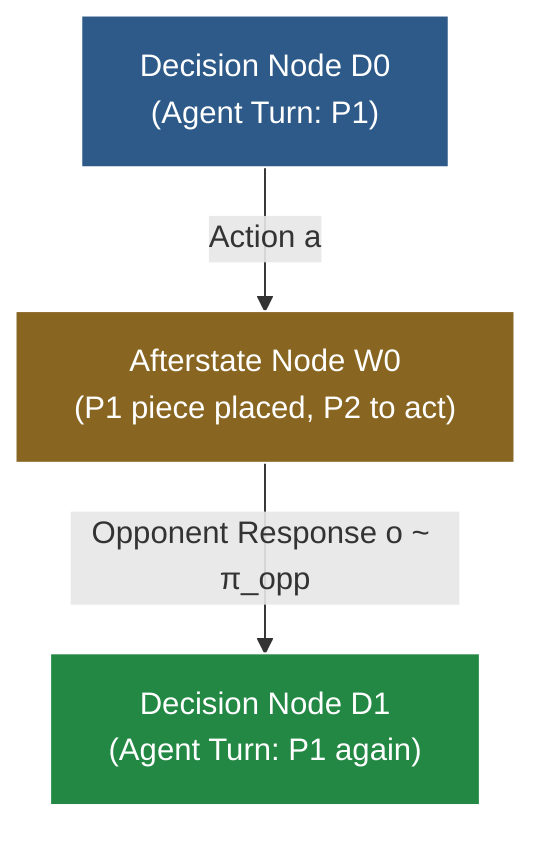

# RFC: Round-Based Macro-Dynamics, Afterstate Nodes & Pluggable Opponent Policies

This document explores the architectural design, formal invariants, and trade-off evaluation for **Round-Based Macro-Dynamics**, **Afterstate Nodes** (Stochastic MuZero / Sutton & Barto style), and **Pluggable Opponent Policies** in the Monte Carlo Tree Search (MCTS) engine.

---

## 1. Motivation & Context

In 2-player turn-based games such as Connect 4 and Hex, the standard convention is **Alternating Multi-Agent Dynamics**:
- State explicitly tracks `current_player`.
- Each transition steps 1 half-move (ply), toggling `current_player = current_player.other()`.
- The search tree alternates between nodes where Player 1 acts and nodes where Player 2 acts.
- Returns are tracked as vectors $\mathbf{Q} \in \mathbb{R}^2$ via [`VectorBackup<2>`](../mcts-engine/src/backup/vector.rs), with selection maximizing the active player's component.

While this approach unifies cleanly with $N$-player games (like 4-player Blokus) and guarantees worst-case adversarial robustness (Minimax equilibrium), it introduces specific friction points:
1. **Evaluator Dilution**: Neural networks or heuristic evaluation models must learn to evaluate positions from *both* players' perspectives (or invert inputs/outputs).
2. **Shallow Effective Depth**: An MCTS search to tree depth $d$ only plans $d / 2$ full game rounds.
3. **Rigid Adversary Assumption**: Standard minimax MCTS assumes the opponent is a game-theoretically optimal adversary. It cannot naturally exploit predictable weaknesses, heuristic patterns, or stochastic tendencies of specific opponents.

---

## 2. Core Concepts & Formal Invariants

### 2.1 Why "Afterstate Node" (vs. "Chance Node")

In reinforcement learning literature (Sutton & Barto, §6.8 *Games, Afterstates, and Other Special Cases*), an **afterstate** is defined as:
> The state immediately *after* the agent commits an action, but *before* the environment's dynamics, chance events, or opponent responses resolve.

```
[Decision Node s_t] ──(Agent Action a)──> [Afterstate Node w_t] ──(Opponent Response o)──> [Decision Node s_{t+1}]
     (My Turn)                               (Waiting for Opponent)                             (My Turn Again)
```

In Connect 4:
- $s_t$: Board state where it is Red's turn to move.
- $w_t$: Board state with Red's piece placed in column $a$, but Yellow has not moved yet.
- $s_{t+1}$: Board state where Yellow has placed piece in column $o$. Red sees the full board and moves again.

Calling $w_t$ an **Afterstate Node** (rather than a "Chance Node") is mathematically precise because the transition out of $w_t$ is not necessarily pure random noise—it can be governed by a deterministic heuristic, a bounded-rational model, an opponent policy network, or an adversarial minimax selection.

### 2.2 The Fundamental Invariant: Trajectories Always End at Decision Nodes

The core architectural invariant proposed is:

$$\text{All MCTS simulation trajectories must terminate and evaluate ONLY at Decision Nodes (or terminal states).}$$



#### Why This Invariant is Essential:
1. **Pure Agent-Centric Evaluation**: The evaluator (`Model::evaluate`) is **only ever invoked on Decision Nodes**. The value function $V(s)$ and policy prior $P(s, a)$ only need to understand positions where it is the primary agent's turn to move.
2. **Strict Round-Level Lookahead**: Every tree iteration advances the simulation by an integer number of full rounds. A tree depth of $d$ guarantees $d$ full rounds (or $2d$ plies) of strategic lookahead.
3. **Clean Terminal Short-Circuiting**: If the primary agent's action $a$ immediately wins the game or fills the board, the transition terminates immediately without an opponent response, naturally creating a terminal Decision Node.

---

## 3. Tree Representation & Zero-Change Compatibility

### 3.1 Node Labeling via `AgentId`

In `mcts-engine::tree_store::TreeStore`, every node already carries an `AgentId`:

```rust
struct NodeArrays {
    parent_edge: Vec<EdgeId>,
    first_child_edge: Vec<EdgeId>,
    num_children: Vec<u32>,
    agent: Vec<AgentId>,
    status: Vec<NodeStatus>,
}
```

Because `store.node_agent(node)` is stored directly in the flat contiguous array:
- **Decision Node**: `store.node_agent(node) == store.node_agent(root)` (matches root agent).
- **Afterstate Node**: `store.node_agent(node) != store.node_agent(root)` (opponent acts).

**No modifications to `TreeStore` data structures or memory layout are required.**

---

## 4. Architectural Implementation Routes

Standard MCTS schedulers (like `SequentialScheduler`) terminate traversal at the *first* unvisited edge (`if !child.is_valid() { break; }`). In a 1-ply step formulation, this would halt at Afterstate nodes on odd plies, violating the invariant.

Two distinct architectural routes resolve this:

### Route A: Coordinated Round Scheduler (`RoundScheduler`)

The scheduler explicitly coordinates descent between Decision Nodes ($D_t$) and Afterstate Nodes ($W_t$) in the tree:

```
Traversal Step:
  1. At Decision Node D_t (agent == primary_player):
     - If Unexpanded: evaluate via Model::evaluate(&state) and expand. Break traversal.
     - If Expanded: select child edge a via primary selection policy (e.g. PUCT).
     - Step dynamics: world.step_action(&mut state, a).
     - If terminal: mark terminal and break traversal.
  2. At Afterstate Node W_t (agent != primary_player):
     - Descend through all intermediate opponents while !world.terminal(&state) && world.current_player(&state) != primary_player.
     - Expand opponent candidate moves and initialize priors via TreeOpponentPolicy::init_afterstate_priors.
     - Select opponent edge o via TreeOpponentPolicy::select_afterstate_child.
     - Step dynamics: world.step_action(&mut state, o).
     - If terminal: mark terminal and break traversal.
  3. Returns to Phase 1 (current_player == primary_player):
     - Evaluates ONLY at leaf Decision Nodes (node_agent == primary_agent). Zero evaluator dilution!
```

#### Trait Abstraction in `mcts-engine::opponent`:

```rust
pub trait TreeOpponentPolicy<Action, Reward, Stats: EdgeStatsStore, State> {
    fn init_afterstate_priors(&self, tree: &mut TreeStore<Action, Reward, Stats>, node: NodeId, state: &State);
    fn select_afterstate_child(&self, tree: &TreeStore<Action, Reward, Stats>, node: NodeId, state: &State) -> Option<EdgeId>;
}
```

Built-in policies:
- **`AdversarialOpponent<S>`**: Adversarial MCTS opponent that searches within the same tree using `S: SelectionPolicy`.
- **`RandomOpponent`**: Uniformly samples random legal child edges.
- **`HeuristicOpponent<P>`**: Adapts any state-based `P: OpponentPolicy<State, Action>` into tree-based search.

---

### Route B: Absorbed Macro-Dynamics (`RoundBasedDynamics<W, P>`)

The opponent policy is absorbed directly inside `AgentDynamics::step`, exposed generically in `mcts-traits::RoundBasedDynamics`:

```rust
pub struct RoundBasedDynamics<W, P> {
    pub world: W,
    pub opponent_policy: P,
    pub primary_player: usize,
}
```

* **Pros**: Requires zero engine changes; compatible with all schedulers (`SequentialScheduler`, `BatchedScheduler` on GPU, `MultiGameScheduler`).
* **Cons**: Afterstate choices are absorbed inside `step()`; not stored as individual tree nodes, so opponent subtrees cannot be promoted via `promote_subtree`.
* **Transition Determinism Invariant**: Because opponent replies are absorbed into a single macro edge without tree branching, re-stepping that edge during simulation descent requires $\tau(s, a) = s'$ to be deterministic. If an opponent policy is stochastic, it must be determinized per state (e.g., via state hashing in `connect4::RandomOpponent`) to prevent state aliasing and tree divergence across iterations. For unconstrained stochastic branching, Route A (`RoundScheduler`) is the mathematically sound formulation as each opponent move receives its own explicit edge in the tree.

---

## 5. Spectrum of Pluggable Opponent Policies

| Opponent Policy $\pi_{\text{opp}}$ | Route A (`TreeOpponentPolicy`) | Route B (`OpponentPolicy`) | Best Used For |
| :--- | :--- | :--- | :--- |
| **`AdversarialOpponent`** | `AdversarialOpponent::new(MultiAgentPuctSelection)` | N/A | Adversarial self-play planning in the same tree; builds minimax visit counts. |
| **`RandomOpponent`** | `mcts_engine::RandomOpponent` | `connect4::RandomOpponent` | Stochastic opponents or expectation planning against random baselines. |
| **`Tactical / Heuristic`** | `HeuristicOpponent::new(TacticalOpponent)` | `RoundBasedDynamics(..., TacticalOpponent)` | Exploiting predictable tactical heuristic responses. |

---

## 6. Comprehensive Trade-Off Evaluation

### 6.1 The Advantages

1. **Elimination of Evaluator Dilution**:
   Value and policy networks only need to predict values for the primary agent. Input tensors do not need "current player" indicators or channel inversions.
2. **Depth Compression for Forced Sequences**:
   In tactical endgames, many moves are forced replies. Absorbing forced moves doubles the lookahead depth per tree node.
3. **Exploitative Play Beyond Nash Equilibrium**:
   Minimax assumes a perfect opponent and plays conservatively. If the opponent has a known blind spot (e.g. failing to detect diagonal traps), a parameterized $\pi_{\text{opp}}$ allows MCTS to find winning traps that minimax would discard as "refutable by optimal play".

### 6.2 The Risks & Pitfalls

1. **Model Misspecification (The Delusion Hazard)**:
   If $\pi_{\text{opp}}$ assigns zero probability to an unorthodox move that the opponent *actually plays*, the MCTS agent will have zero tree branches prepared for that reply. Minimax remains the safest choice when the opponent's strategy is unknown.
2. **Branching Factor in Explicit Afterstates (Route A)**:
   If afterstates branch on all 7 opponent columns, the tree still contains $7 \times 7 = 49$ leaves per round. Explicit afterstates require candidate pruning (e.g. top-$K$ opponent moves) to achieve speedups.
3. **Self-Play Training Symmetry**:
   In AlphaZero self-play, both players share identical networks and update synchronously. Absorbing a static opponent policy is ideal for playing against humans or fixed agents, but complicates symmetric self-play training unless $\pi_{\text{opp}}$ is dynamically tied to the agent's current network checkpoint.

---

## 7. Implementation & Integration Status

1. **`mcts-traits`**:
   - `StepOutcome<Reward, StepDelta>`: Emits immediate rewards, transition deltas (`StepDelta`), and termination status.
   - `AgentDynamics`: Associated type `type StepDelta: Eq + Clone + Debug` allowing stochastic and opponent reaction branching.
   - `OpponentPolicy<State, Action>`: Generic trait for state-based opponent responses.
   - `RoundBasedDynamics<W, P>`: Universal macro-action dynamics adapter emitting opponent reply in `StepDelta`.
2. **`mcts-engine`**:
   - Zero-allocation `StepDelta` branching in `TreeStore`: child nodes indexed by `(EdgeId, StepDelta)`.
   - Unified `SequentialScheduler`: single universal scheduler executing both standard 1-ply MCTS and multi-outcome macro dynamics, enforcing the Single-Perspective Decision Leaf Evaluation Invariant.
   - `TreeOpponentPolicy`, `AdversarialOpponent`, `RandomOpponent`, `HeuristicOpponent`.
3. **`connect4`**:
   - `RandomOpponent` (uniform random with `rand::thread_rng()`) and `TacticalOpponent`.
   - `MacroConnect4Dynamics`: full round lookahead emitting `StepDelta = Option<usize>`.
   - `MacroMctsAgent` & `RoundMctsAgent`: full-round macro agents executing cleanly via `SequentialScheduler`.
   - Multi-agent round-robin tournament runner supporting arbitrary agent combinations.
4. **`tzf8`**:
   - Stochastic 2048 game dynamics using `StepDelta = TileSpawn { pos: u8, val: u16 }` for sample-mean Expectimax search down flat `TreeStore` arrays.
   - Dynamic Min-Max normalization (`NormalizedUctSelection`, `NormalizedPuctSelection`) scaling arbitrary score values into $[0, 1]$ exploration balance.
   - Multi-agent tournament benchmark arena comparing heuristics, rollouts, pure UCT, normalized UCT, and PUCT.


